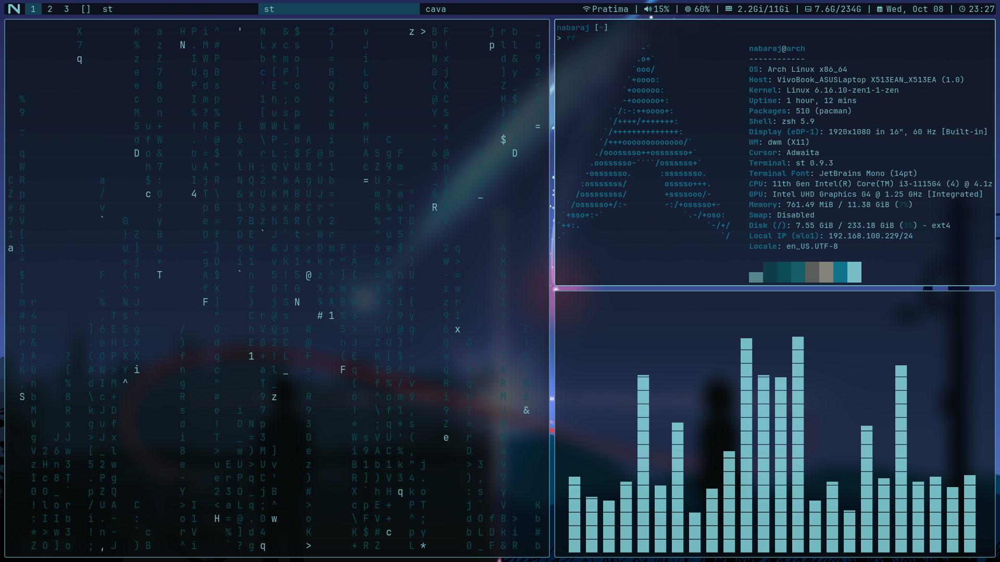

# My DWM Dotfiles

Custom **DWM (Dynamic Window Manager)** setup with a sleek, minimal, and neon-inspired aesthetic.  

<p align="center">
  
</p>

## Features

- Fully **tiling and minimal** workflow  
- **Dark neon aesthetic** with translucent windows  
- Optimized for **speed and smoothness**  
- Pre-configured **dmenu, st, and DWM blocks**  
- Easy to adapt for your own Arch Linux setup  

## Installation

```bash
git clone --depth=1 https://github.com/nabaraj-bhandari/dotfiles.git

